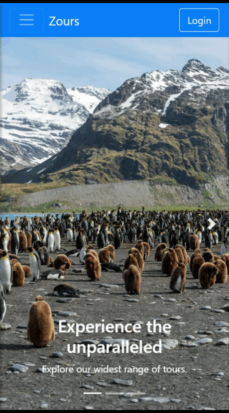
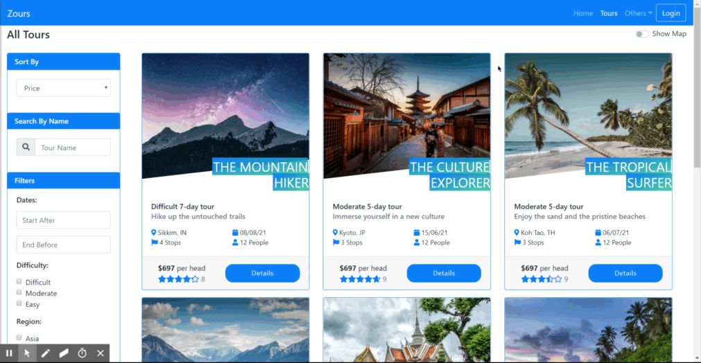
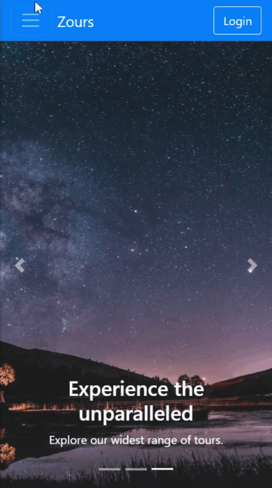
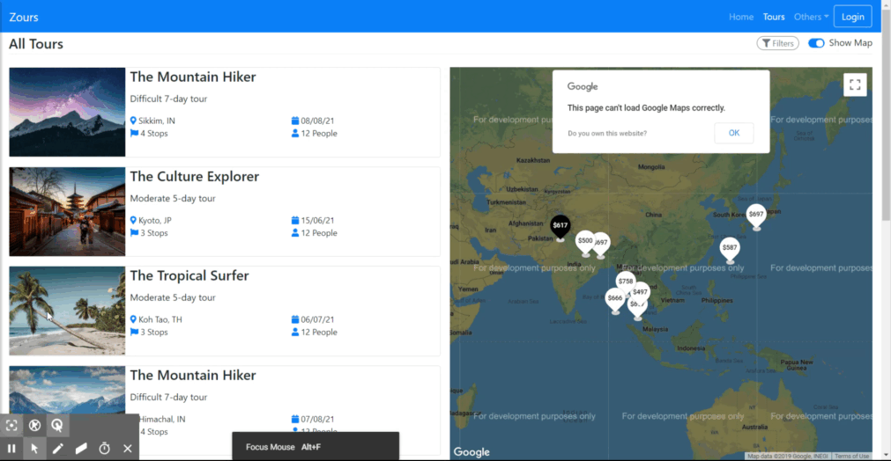
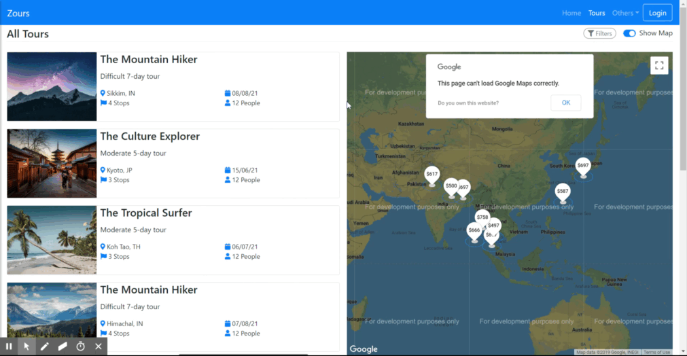
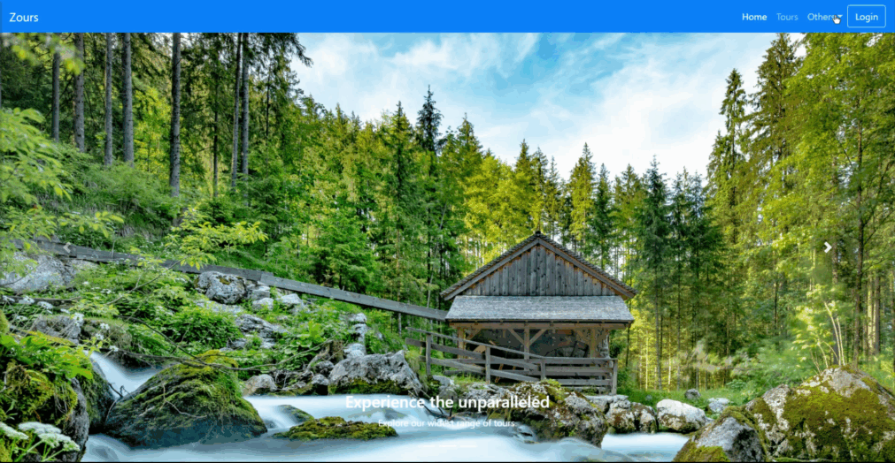
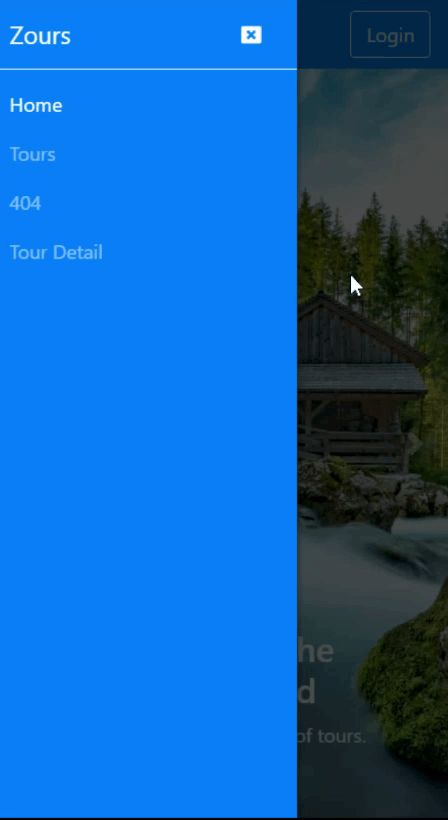
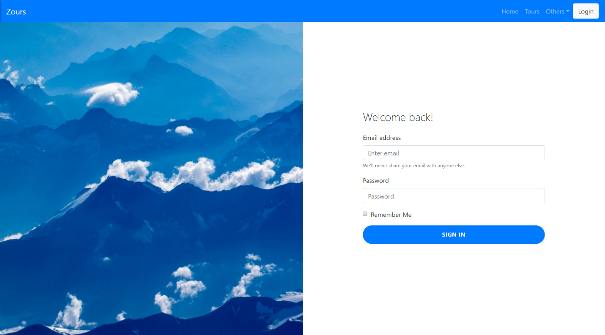

A React Based completely responsive front End.
==============================================

A simple [create-react-app](CRA-README.md) setup, showcasing a working front end
for a tour app. This is ultimately meant to serve as the front end for the
express-tours api endpoints which are also in my repository.

The live app in codesandbox can be found here:  
<https://g4dfy.csb.app/>

**Following Technologies/Libraries have been used here :**

-   React

-   React-Router

-   React-Bootstrap

-   TypeScript

-   Google-map-react

**Missing/To be done :**

-   A styling solution, can be css-modules, styled-components or `emotion`. As
    of now, vanilla stylesheet file has been used.

-   `Redux` Integration.

-   Currently, all the data about the places is fetched from a static
    `places.json` file, removing that and complete integration with the existing
    express api endpoint is to be done.

-   User account related screen with role considerations.

-   Configuring `BrowserRouter` routes for it to be deployed properly through
    github pages. Animated Images of the app:

