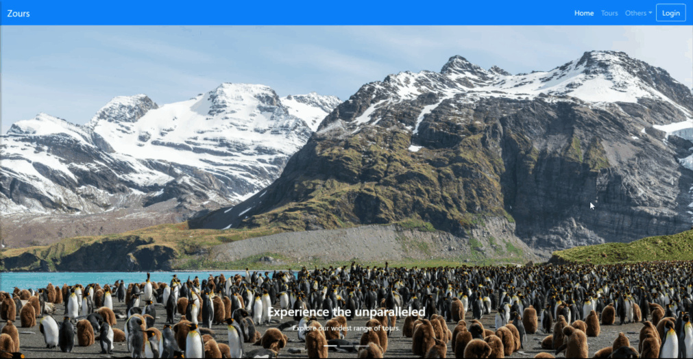
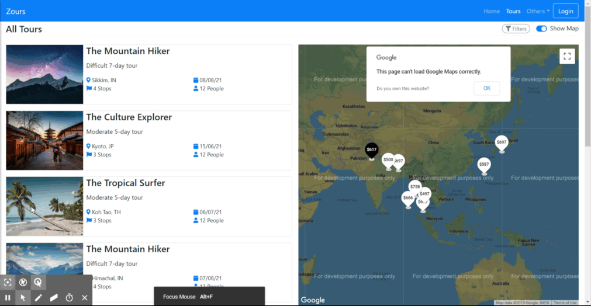
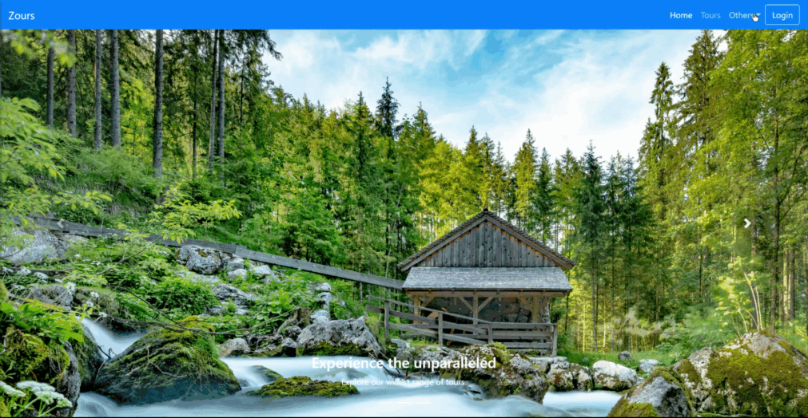

**Following Technologies/Libraries have been used here :**

-   React

-   React-Router

-   React-Bootstrap

-   TypeScript

-   Google-map-react

The live app can be found here:  
<https://g4dfy.csb.app/>

**Missing/To be done :**

-   A styling solution, can be css-modules, styled-components or emotion. As of
    now, vanilla stylesheet file has been used.

-   Redux Integration.

-   Currently, all the data about the places is fetched from a static
    \`places.json\` file, removing that and complete integration with the
    existing express api endpoint is to be done.

-   User account related screen with role considerations.

Animated Images of the app:

